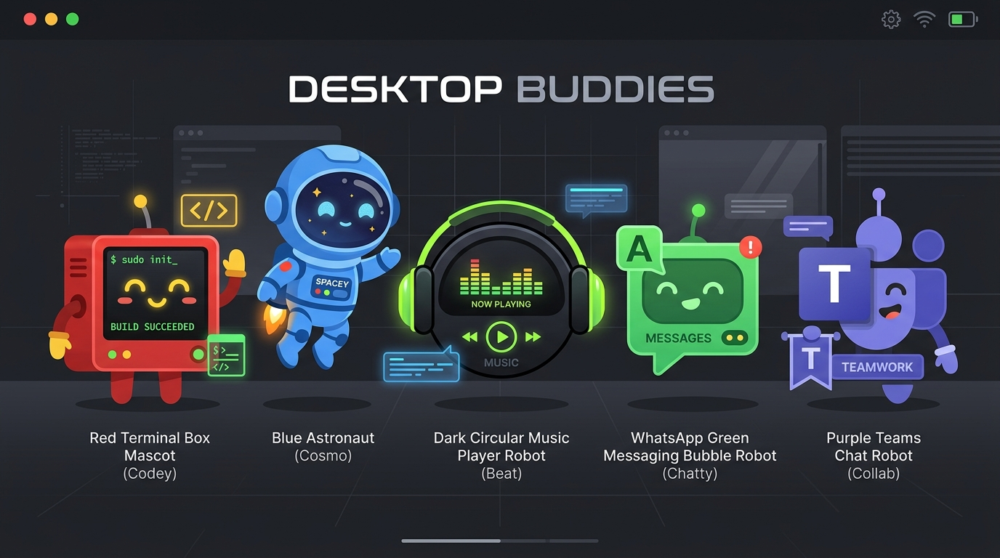

# Agent Pal 🤖🚀

<p align="center">
  
</p>

**Agent Pal** is an interactive, physics-based desktop buddy application for Windows that monitors terminal-based AI coding agents (such as *Claude Code*, *Antigravity CLI*, *Codex*) and acts as a customizable general application companion for popular communication and music apps (like *Spotify*, *WhatsApp*, *Microsoft Teams*).

It helps you keep track of background agents by roaming your screen and visually alerting you when they are busy, waiting for input, or have finished their tasks, while keeping you synced with your daily apps.

---

## ✨ Features

### 💻 AI Agent Mascots
- **Antigravity CLI**: A floating blue astronaut with active thruster flames that defies gravity and hovers around.
- **Claude Code**: A coral-colored terminal box with orange outlines and blinking green CLI code eyes (`> _`).
- **Generic/Codex Agents**: A classic green-themed terminal monitor.
- **Visual Activity States**:
  - **Writing Code**: Draws a small typewriter keyboard and typing hands wiggling up and down when process CPU is active.
  - **Researching**: Holds a tiny bobbing magnifying glass when inspecting files.
- **Task Success Alert (`✔`)**: Displays a green checkmark bubble and makes the buddy celebrate with a joyful leap and sparkling stars when the task completes.
- **Smart Attention Alert (`!`)**: If the agent drops to 0% CPU (waiting for your input) AND its terminal window is not active, a floating red `!` speech bubble appears over the buddy to grab your attention.

### 🎵 Non-Agent Companions (General Apps)
These companions are kept separate from coding-agent mechanics (they ignore spawned code bugs and do not display CPU warning alerts):
- **Spotify**:
  - Displays a dark body with green over-ear headphones, animated glowing graphic equalizer bars for eyes, and a curved soundwave smile.
  - Floats a Spotify-green speech capsule above its head containing the song title (with looping marquee scrolling for long titles).
  - Spawns floating musical note particles (`♪`, `♫`, `♩`, `♬`) when music is playing.
- **WhatsApp**:
  - Spawns a green chat bubble bot with a telephone receiver icon inside.
  - Tracks unread message notifications. If you have unread messages, it hops excitedly, shows a red exclamation alert badge, and spawns message text particles (`💬`, `Hi`, `Hey`, `Hello`).
- **Microsoft Teams**:
  - Spawns a corporate purple robot with the Teams logo.
  - Tracks active meeting/call status. If you are in a call, its eyes glow warning red, it vibrates nervously to show it's busy, shows a red recording dot, and spawns meeting text particles (`💼`, `Call`, `Meet`, `Sync`, `📅`).

### 🏃 Physics & Game Mechanics
- **Throwing Physics**: Drag and throw buddies across your desktop. They fall back down with gravity and realistic squash-and-stretch landing impacts.
- **Leap-Over Crossing Physics**: When two buddies collide (either walking in opposite directions or passing from behind), they have a **50% chance to jump over each other** instead of bouncing back, allowing them to cross paths dynamically.
- **Interactive Game (Spawn Code Bug)**: Right-click any agent buddy to spawn a crawling code bug. Agent buddies enter a **Chasing** state, run towards the bug, jump on it to squash it, and celebrate with sparkling stars.

---

## 🛠️ Installation & Setup

Clone the repository and run the batch installer:

```bash
install.bat
```

This installer:
1. Installs all Python dependencies (`psutil`, `pywin32`) and packages `agent-pal` as a local command-line script.
2. Creates a windowless Windows startup script (`agent-pal-startup.vbs`) in your Windows Startup folder so Agent Pal starts silently in the background when your PC boots.

---

## 🚀 Usage

### 1. Silent Background Mode (Default)
Run the coordinator silently in the background:
```bash
pythonw.exe -m agent_pal
```
*(Or simply let the Windows Startup script run it).*
- When no monitored apps or CLI agents are running, the application has **no screen footprint** (runs silently in the background).
- As soon as you open **Claude Code**, **Antigravity CLI**, **Spotify**, **WhatsApp**, or **Teams**, their dedicated buddies will pop up on your taskbar.
- When you close the apps, their buddies disappear automatically.

### 2. Single-Session Mode (Auto-Exit)
If you only want Agent Pal to run for the duration of a single terminal session and exit completely when the terminal is closed, run:
```bash
agent-pal --exit-when-idle
```

---

## 🕹️ Controls & Click Gesture State Machine

Agent Pal implements a delayed multi-click state machine to prevent click overlap:

- **Left-Click + Drag**: Pick up and throw buddies. If the Spotify Pal is dragged/giggled, it wiggles, giggles, and triggers a skip to a **Next/Random Song**.
- **Single Click**: Toggles Play/Pause on Spotify (applies to others as normal focus click).
- **Double Click**: Plays the **Previous Track** on Spotify (focuses the window on other buddies).
- **Triple Click**: Plays the **Next Track** on Spotify.
- **Right-Click Menu**:
  - **Mark Alert as Read**: Clear any floating checkmark or exclamation bubble instantly.
  - **Mute Alerts**: Mutes visual alert bubbles.
  - **Hold Buddy**: Pauses physics, holding the buddy in place.
  - **Spawn Code Bug**: Drops a crawling purple bug for agent buddies to chase.
  - **Exit Pal**: Shuts down the coordinator application.

---

## 🛠️ Developer-Friendly Pal Registry

Agent Pal is designed to be easily extensible. Developers can add new companion buddies (e.g. Chrome, Discord, Slack) in a few lines of code by defining a drawing function and registering a `PalDefinition`:

```python
register_pal(PalDefinition(
    keyword="whatsapp",
    mascot_type="whatsapp",
    draw_skin_fn=draw_whatsapp_skin,
    process_filter_fn=filter_whatsapp_process,
    status_check_fn=check_whatsapp_status,
    on_single_click_fn=on_app_single_click,
    reacts_to_bugs=False,           # Don't chase bugs
    show_agent_alerts=False,        # Don't show CPU warnings
    strict_name_match=True          # Match strictly by process name
))
```

See [developer_pal_guide.md](developer_pal_guide.md) for a detailed step-by-step walkthrough.
